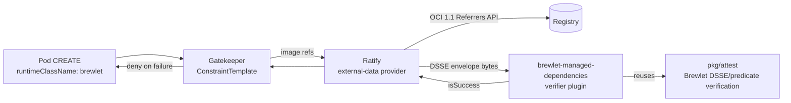

# Brewlet admission enforcement (Ratify + Gatekeeper)

Production admission policy that **enforces Brewlet managed-dependency
signatures and identities** before a workload runs. It admits a pod on the
Brewlet runtime only when its image carries a valid, trusted final-image
managed-dependency attestation.

This closes the last open acceptance item of the managed-dependency-bundles
work (issue #10): *"Provide production admission-policy examples/integration for
enforcing required signatures and identities."*

## What it enforces

For every pod with `spec.runtimeClassName: brewlet`, each container image must
have a Brewlet **managed-dependency attestation** that:

- is an OCI 1.1 referrer with artifactType
  `application/vnd.brewlet.attestation.v1+json` carrying one
  `application/vnd.dsse.envelope.v1+json` layer;
- is a DSSE/in-toto Statement v1 with predicate type
  `https://brewlet.sh/attestations/managed-dependencies/v1`;
- is signed **ECDSA P-256** (ASN.1 DER over the DSSE PAE), with a `keyid` equal
  to `sha256(SPKI DER)`, verified against the operator-configured trusted public
  key;
- binds `finalImageDigest` to the admitted image's resolved digest, has
  `thinJar: true`, and carries well-formed digests for the application JAR,
  dependency bundle, dependency layer, lock, and SBOM; and
- names the expected application-builder identity **verbatim**.

Anything missing, malformed, signed by the wrong key, naming the wrong identity,
or bound to a different subject is **denied (fail closed)**.

## How it works



Ratify's `oras` referrer store performs registry discovery, authentication, and
blob fetch. The **Brewlet verifier plugin** (`admission/ratify-verifier`) runs
Brewlet's *exact* verification code — `github.com/brewlet/brewlet/pkg/attest`,
the single source of truth also used by the `brewlet` CLI and Maven plugin — over
the fetched DSSE envelope. There is no divergent crypto and no republishing of
the artifact into another signature format.

### Why not Kyverno / cosign policy-controller directly

Brewlet publishes a **custom** attestation artifact (its own artifactType and
in-toto predicate types) signed with a bare-key DSSE profile. Kyverno's image
verification and Sigstore's policy-controller consume **cosign**/**notation**
signature formats; they cannot consume Brewlet's artifact without first
republishing it in a cosign/notation layout. Ratify's external verifier plugin
model lets us verify the native Brewlet artifact **in place**, which is why this
integration targets Ratify.

## Pinned Ratify version and protocol

- Target: **Ratify v1.4.5** (CNCF sandbox; repo `github.com/notaryproject/ratify`,
  Go module path `github.com/ratify-project/ratify`). v2 is pre-release and is
  **not** targeted.
- The plugin implements the v1 **external verifier plugin protocol**: Ratify
  invokes the binary as a subprocess, sets `RATIFY_VERIFIER_COMMAND=VERIFY`,
  `RATIFY_VERIFIER_SUBJECT`, `RATIFY_VERIFIER_VERSION`, passes a
  `PluginInputConfig` JSON on stdin, and reads a `VerifierResult` JSON from
  stdout. The plugin uses the official `pkg/verifier/plugin/skel` entrypoint,
  and blank-imports `pkg/referrerstore/oras` so the skel can reconstruct the
  referrer store in-process to fetch the DSSE envelope.

## Build and publish the plugin

```bash
cd admission/ratify-verifier
go build -o brewlet-managed-dependencies .
```

Deliver the binary to Ratify one of two ways:

1. **Dynamic plugin** (shown in `deploy/20-ratify-verifier.yaml`): publish it as
   an OCI artifact and set `spec.source.artifact`; Ratify downloads it at
   startup.
2. **Baked image**: place the binary at
   `/home/nonroot/.ratify/plugins/brewlet-managed-dependencies` in a custom
   Ratify image and drop `spec.source`.

The plugin binary links Ratify's oras store, and therefore its full dependency
tree (oras-go plus cloud registry auth SDKs). Build it with the same toolchain
you use for Ratify itself.

## Deploy

Prerequisites: Ratify v1.4.x installed as a Gatekeeper external-data provider
(`ratify-provider`), Gatekeeper installed, and a registry that exposes the
OCI 1.1 Referrers API.

```bash
# 1. Edit deploy/20-ratify-verifier.yaml: set trustedPublicKey and
#    expectedBuilderIdentity (and the plugin source image).
kubectl apply -f deploy/10-ratify-store.yaml
kubectl apply -f deploy/20-ratify-verifier.yaml
kubectl apply -f deploy/30-ratify-policy.yaml
kubectl apply -f deploy/40-gatekeeper-constrainttemplate.yaml
kubectl apply -f deploy/50-gatekeeper-constraint.yaml
```

Start the Gatekeeper constraint with `enforcementAction: warn` or `dryrun`,
confirm results, then switch to `deny`.

For non-Kubernetes verification (CI), `deploy/config.json` drives
`ratify verify -s <image@sha256:...> -c deploy/config.json`.

## Production requirements and limitations

Read these before relying on this in production. Several are hard requirements
that fail closed when unmet.

### Registry: OCI 1.1 Referrers API is required
Ratify's oras store discovers referrers through the OCI 1.1 Referrers API (via
oras-go). Brewlet's own **deterministic per-referrer fallback tag scheme**
(spec §4.5:
`sha256-<subject>.<12 hex of sha256(artifactType)>.<24 hex of referrer digest>`)
is *not* the oras-go fallback tag scheme. On a registry that does **not**
implement the Referrers API, Ratify will not discover Brewlet attestations and
admission fails closed (deny). Use a Referrers-API-capable registry for images
that must be admitted.

### Private images: registry authentication
For private images, configure the oras store's `authProvider` (e.g. `k8Secrets`
with a docker-config Secret, or a cloud identity provider). Without credentials,
referrer discovery/blob fetch fails and admission denies.

### Key distribution and rotation are out of band
The trust anchor is a bare ECDSA P-256 public key (`trustedPublicKey` inline, or
`trustedPublicKeyPath` mounted). There is no Fulcio/keyless issuance and no Rekor
transparency log in this Brewlet contract. You must distribute and rotate the
public key yourself. During rotation, publish attestations under both the old and
new keys (Brewlet's per-referrer tags preserve multiple signatures); configure
the verifier with the currently trusted key(s). Use the Ratify verification
policy (`any` vs `all`) to decide whether one or all discovered attestations must
verify — for signer rotation prefer `any` at the verifier layer.

### Identity is a free-form string trusted only through the key
`expectedBuilderIdentity` is compared verbatim against the `builderIdentity` in
the signed predicate. It is **not** a cryptographically-issued identity; it is
trustworthy only because the surrounding predicate is signed by the trusted key.
Anyone holding the trusted private key can assert any identity string. Treat the
key as the real trust boundary and scope identities per key accordingly.

### Image-level vs bundle-level signer enforcement
This integration enforces the **final-image** managed-dependency attestation. Its
predicate binds the dependency-bundle **digest**, source BOM, and the
**application-builder** identity — but it does **not** expose the bundle
**publisher's** signer identity. Therefore this admission path cannot directly
assert *"the bundle was signed by platform-team X."* It asserts that a trusted
application builder produced a thin-JAR image from a specific bundle digest.
Bundle-publisher trust is verified upstream, at Brewlet application publication
time (`brewlet:push` with `trustedPublicKey`/`trustedSignerIdentity`), which
refuses to compose an image from a bundle whose provenance does not match. Do not
represent this admission control as bundle-signer admission enforcement.

### Fail-closed on missing attestation is a policy-layer property
The plugin is only invoked once a matching referrer exists; it cannot deny an
image that has *no* Brewlet referrer at all. Denial of unattested images is
enforced by the Ratify verification policy plus the Gatekeeper constraint
(`deploy/30`/`50`). Ratify's exact aggregation semantics vary by version, so
**validate on your Ratify version** that an unattested image is denied (see the
smoke test) before depending on it.

### Scope
The Gatekeeper template only enforces on pods with
`spec.runtimeClassName: brewlet` (including raw workloads, not just
`JavaApplication`-managed pods). Non-Brewlet workloads are never subject to these
checks. Pin images by digest (`repo@sha256:...`) — a tag is resolved by Ratify,
but digest pinning removes the resolve step and the mutable-tag race.

## Fail-closed behavior

The plugin returns `isSuccess: false` for every one of:

| Condition | Result |
|---|---|
| No trusted key / wrong signing key | deny |
| Wrong / missing `expectedBuilderIdentity` | deny |
| Subject digest mismatch (predicate binds a different image) | deny |
| Tampered DSSE payload or signature | deny |
| Wrong predicate type (e.g. a bundle predicate) | deny |
| `thinJar != true` or malformed predicate digests | deny |
| Manifest not exactly one DSSE layer | deny |
| Registry manifest/blob fetch error | deny |
| Non-digest / unresolved subject | deny |
| No Brewlet attestation referrer at all | deny (policy + constraint) |

## Smoke test

```bash
# Should PASS: an image published with a valid managed-dependency attestation
#   signed by the trusted key/identity.
ratify verify -s registry.example.com/apps/orders@sha256:<digest> -c deploy/config.json

# Should FAIL (deny): the same image verified against a DIFFERENT trusted key,
#   or an image with no Brewlet attestation.
```

In-cluster, apply the constraint in `deny` mode and confirm that a Brewlet pod
whose image lacks a valid attestation is rejected, while a properly attested one
is admitted.

## Tests

- `admission/ratify-verifier` unit/contract tests exercise the plugin's
  `VerifyReference`/`verifyManaged` against the **real** Ratify `ReferrerStore`
  interface with a fake store, covering the full fail-closed matrix above, plus
  config parsing.
- `core/pkg/attest` tests cover the shared DSSE/predicate verification directly.

Run:

```bash
( cd core && go test ./pkg/attest/... )
( cd admission/ratify-verifier && go test ./... )
```
