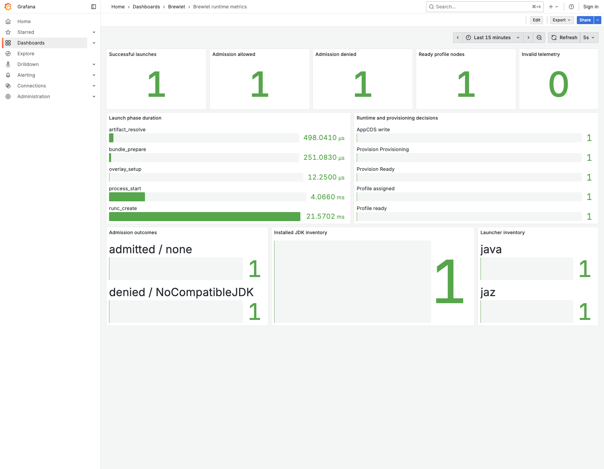
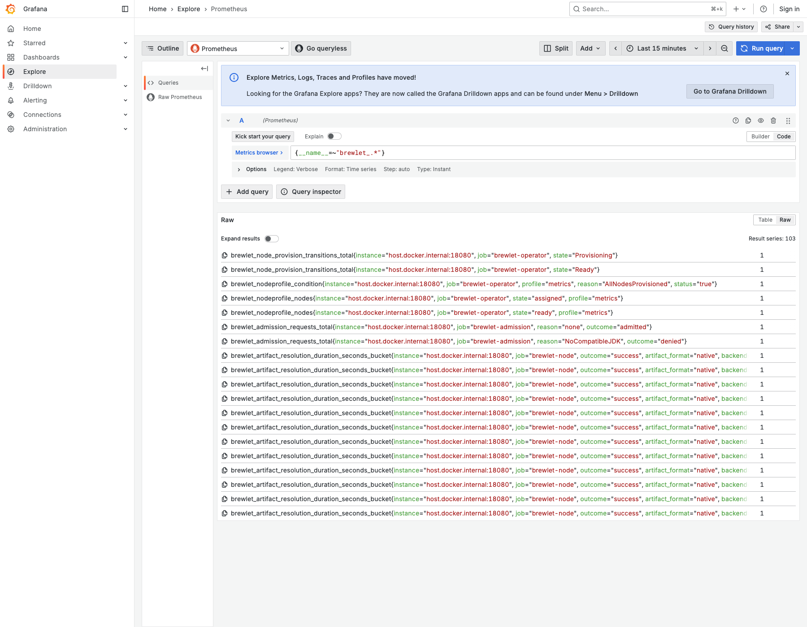

# Brewlet metrics exporter

The node-local exporter receives bounded, best-effort telemetry from the
containerd shim over `/opt/brewlet/metrics/telemetry.sock` and exposes
Prometheus metrics for sandbox launches, artifact resolution, AppCDS decisions,
and installed JDK and launcher inventory.

## Screenshots

These images were captured from Grafana 12.1.0 backed by Prometheus 3.5.0. The
metric samples came from a live metrics-enabled tier 15 integration test and
are stored with the exporter for reuse by the documentation site.

### Grafana runtime dashboard

### Grafana Explore

